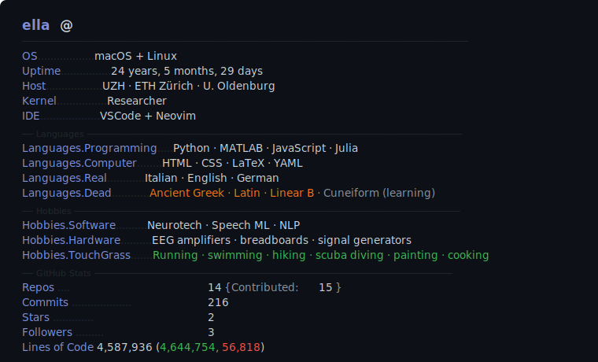

<!-- GitHub auto-switches between the two SVGs based on the viewer's colour scheme -->
<picture>
  <source media="(prefers-color-scheme: dark)"  srcset="dark_mode.svg">
  <source media="(prefers-color-scheme: light)" srcset="light_mode.svg">
  
</picture>

  

